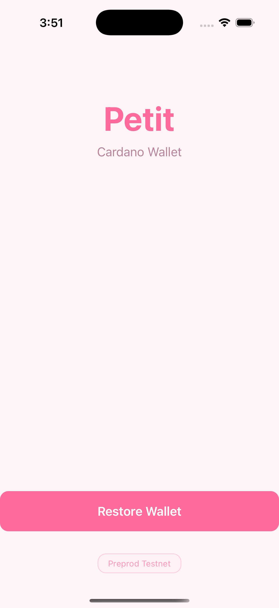

# Petit - A Simple Cardano Wallet Mobile App

## Overview

Petit is a lightweight, read-only Cardano wallet built as a mobile application for iOS. This project is a collaborative learning initiative focused on gaining hands-on experience with mobile app development and blockchain technology.

## Screenshot

<p align="center">
  
</p>

## Purpose

This project serves as a practical learning environment to deepen our technical knowledge through real-world development experience.

## Features (MVP)

- **Import/Restore Wallet** - Restore existing wallet using 24-word recovery phrase
- **View Balance** - Display ADA balance from Cardano blockchain
- **Read-Only** - No transaction capabilities in first release

## Learning Objectives

Through the development of Petit, we aim to gain proficiency in:

- **Mobile App Development** - Building cross-platform mobile applications using Expo / React Native
- **Quality Assurance** - Practicing E2E testing with Maestro
- **Git & GitHub Workflow** - Practicing branch management, code reviews, and collaborative development processes
- **API Integration** - Implementing Cardano APIs (Muesli, Blockfrost)
- **UI/UX Development** - Building intuitive and responsive user interfaces

## Technical Stack

| Category | Technology |
|----------|------------|
| **Framework** | Expo / React Native |
| **Language** | TypeScript |
| **Blockchain** | Cardano (Preprod Testnet) |
| **APIs** | Muesli API, Blockfrost |
| **E2E Testing** | Maestro |
| **Distribution** | Simulator, TestFlight |

## Dependencies (MVP)

- `expo` - React Native framework
- `cardano-serialization-lib` - Address decoding, blockchain data parsing
- `axios` - API calls
- Expo config - Environment variables

## UI Flow

```
1. Import Wallet    → Title "Petit" + "Restore Wallet" button
2. Recovery Phrase  → 24-word input box + "Next" button (greyed out if invalid)
3. Loading          → Animated loading screen
4. Balance Display  → Simple ADA balance (no fiat conversion)
```

## Project Phases

1. **Build the App** - Develop the Cardano wallet mobile application
2. **Set Up the Simulator** - Configure iOS simulator environment
3. **Write E2E Test Automations** - Create end-to-end tests using Maestro

## Installation

### Prerequisites
- Node.js (v18 or later)
- Expo CLI (`npm install -g expo-cli`)
- Xcode (for iOS simulator)

### Steps

1. **Clone the repository**
   ```bash
   git clone https://github.com/yan-mei/petit.git
   cd petit
   ```

2. **Install dependencies**
   ```bash
   npm install
   ```

3. **Start the app**
   ```bash
   npx expo start
   ```

4. **Run on iOS simulator**
   - Press `i` in the terminal to open iOS simulator

## Environment Variables

```
MUESLI_API_URL=https://api.muesliswap.com/
BLOCKFROST_API_URL=https://cardano-preprod.blockfrost.io/api/
NETWORK=preprod
```

## Contributors

- Mei
- Taro
